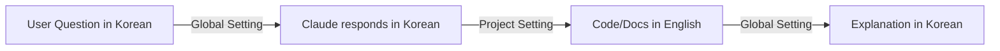

# Code and Documentation Language Standards

> **Scope**: This file controls **code and documentation language only**.
> **For conversation language**: See global `~/.claude/conversation-language.md`

## Core Principle

All code and technical documentation uses **English** for global accessibility and professional standards.

## Language Requirements

### Source Code 🔤

| Component | Language | Example |
|-----------|----------|---------|
| Variable names | English | `userCount`, not `user_count_kr` |
| Function names | English | `calculateTotal()`, not `calc_total_native()` |
| Class names | English | `DataProcessor`, not `DataProcessorLocal` |
| Constants | English | `MAX_RETRY_COUNT`, not `MAX_RETRY_CNT_LOCAL` |
| Comments | English | `// Check user permissions` |
| Error messages | English | `throw new Error("Invalid input")` |
| Log messages | English | `logger.info("Processing started")` |

### Documentation 📚

| Document Type | Language | Rationale |
|--------------|----------|-----------|
| README.md | English | GitHub/GitLab standard |
| API docs | English | International integration |
| Code comments | English | Team collaboration |
| Architecture docs | English | Technical clarity |
| Commit messages | English* | See `git-commit-format.md` |
| PR descriptions | English | Code review standard |
| Issue templates | English | Bug tracking consistency |

*Note: Commit messages follow specific format in `git-commit-format.md`

## Relationship with Global Settings



### Division of Responsibility

| Aspect | Controlled By | Language |
|--------|--------------|----------|
| Claude's responses | `~/.claude/conversation-language.md` | Korean |
| Code generation | This file | English |
| Error explanations | `~/.claude/conversation-language.md` | Korean |
| Documentation files | This file | English |
| Chat discussions | `~/.claude/conversation-language.md` | Korean |

## Practical Examples

### ✅ Correct Implementation

```python
# English comment explaining the logic
def validate_user_input(data: dict) -> bool:
    """
    Validates user input according to business rules.

    Args:
        data: User input dictionary

    Returns:
        bool: True if valid, False otherwise
    """
    if not data:
        raise ValueError("Input data cannot be empty")
    return True
```

**Claude's explanation**: "This function validates user input. According to business rules..."

### ❌ Incorrect Implementation

```python
# Non-English comments - avoid this
def validate_input_local(data_param: dict) -> bool:
    """
    Non-English docstring - avoid this.
    """
    if not data_param:
        raise ValueError("Non-English error message")
    return True
```

## Special Cases

### Korean Project Requirements

If a project specifically requires Korean (e.g., Korean government project):
1. Create `CLAUDE_KO.md` override file in project root
2. Explicitly state Korean requirements
3. This overrides the English default for that project only

### Mixed Content Scenarios

| Scenario | Approach |
|----------|----------|
| Korean company names in code | Romanize: `class SamsungAPI` |
| Locale-specific features | English with context: `// Handles local postal code format` |
| Localization files | Keep original: `"welcome": "<localized_string>"` |
| Test data with Korean | Document purpose in English: `// Test Korean character handling` |

## Quick Decision Tree

```
Is it code or documentation?
├─ YES → Use English
│   ├─ Variable/Function/Class → English names
│   ├─ Comments → English
│   └─ Documentation → English
└─ NO → Is it Claude's response?
    ├─ YES → Use Korean (see global settings)
    └─ NO → Project-specific override
```

## Enforcement

- **Linting**: Configure ESLint/Pylint to flag non-ASCII identifiers
- **PR Reviews**: Check for English consistency
- **Git Hooks**: Validate commit messages are in English

---
*Part of project configuration. Version 1.1.0*
*Complements global `conversation-language.md` without overlap*